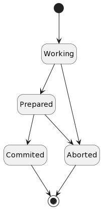

# Transaction Commit

Model of resource managers doing transaction commits.



## EXCEPT

```
rmState' = [rmState EXCEPT ![r] = "committed"]
```

Leave all states the same as they are, _except_ the one signified by _r_ which
is set to `commited`.

## \#

`#` means `not equal`.
